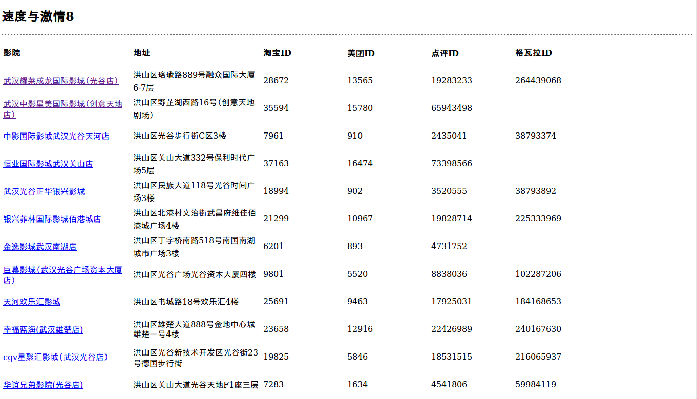
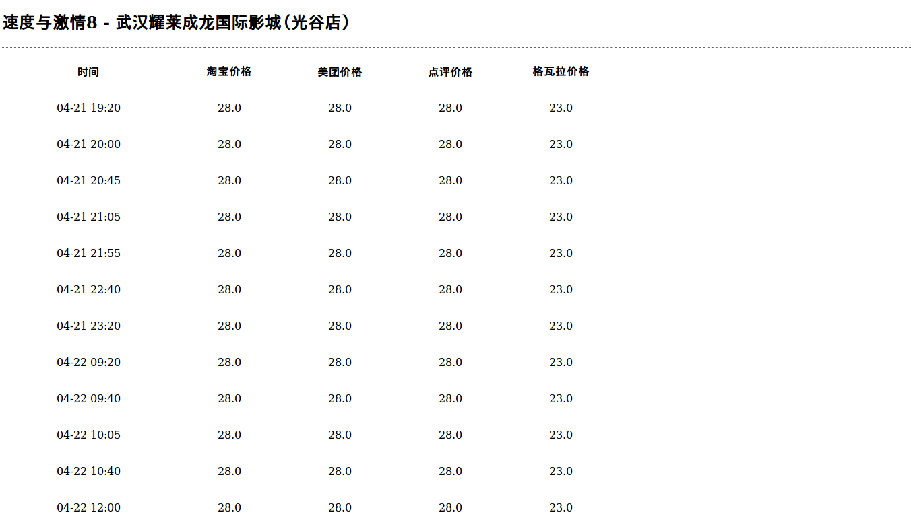

# TicketPrices
用python爬虫抓取洪山区不同网络平台的电影票信息并比较价格。参考了[MovieTickets](https://github.com/LiangCY/MovieTickets)项目。利用requets / beautifulsoup / PhantomJS / selenium抓包爬虫，flask作为网站的框架，pymango用来存储数据。

### 使用方法
* 运行python run.py
* 在浏览器中输入 http://localhost:5000/

### 存在问题
* 由于各种购票平台电影院的名字和地址不太相同，所以获得的电影院信息不够完整。
* 为了防止被block掉，爬虫的速度很慢
* 因为电影票信息太多，所以是在网页上选择了特定的电影院和电影之后再临时爬取数据，所以当排片多的时候服务器会响应很久。

### 页面截图

